# DRY in React: A Study in Composability Over Configuration

## 📖 Start Here

**Before reading this:** Please read Swizec Teller's original article:

### [**"DRY is a footgun, remember to YAGNI"**](https://swizec.com/blog/dry-is-a-footgun-remember-to-yagni/)

This codebase is a response to that article. Understanding Swizec's argument is essential context for the counter-thesis presented here.

---

## Thesis

The problem with [DRY (Don't Repeat Yourself)](https://en.wikipedia.org/wiki/Don%27t_repeat_yourself) isn't the principle itself, but the approach. Instead of anticipating flexibility through configuration props, **expose internal primitives for composition**.

---

## Context: The DRY Footgun

In his article, Swizec identifies a critical problem with premature abstraction. He describes how a generic button component evolves:

> "You start with a simple button component. Then you need a blue one. Then a green one. Then one that's disabled sometimes. Then one that's only disabled when some other state is true. Then..."

The pattern he describes is familiar to anyone who's worked in a large [React](https://react.dev/) codebase: a component starts simple, accumulates props to handle edge cases, and eventually becomes a configuration nightmare:

```jsx
// The anti-pattern Swizec warns against
<GenericButton
  variant="primary"
  size="large"
  disabled={!isActive}
  color="green"
  onClick={handleClick}
  showLoader={isLoading}
  iconPosition="left"
  // ... 15 more props
/>
```

Swizec's conclusion:

> **DRY leads to bloated abstractions. Use YAGNI instead—don't abstract until patterns genuinely emerge.**

([YAGNI: "You Aren't Gonna Need It"](https://en.wikipedia.org/wiki/You_aren%27t_gonna_need_it))

---

## The Problem with This Conclusion

Swizec is right about the symptom, but the diagnosis misses something crucial. The issue isn't DRY itself—it's **configuration-based abstraction**.

When you try to make a component flexible by adding props for every scenario, you're making a flawed assumption:

**You can predict what flexibility points your consumers will need.**

You can't.

This codebase demonstrates an alternative approach: **don't predict flexibility—provide composability.**

---

## Two Approaches to Abstraction

Let's make this concrete. Imagine you need buttons with different colors and behaviors.

### ❌ Configuration-Based DRY (The Footgun)

```javascript
// Attempt to predict all variations
const GenericButton = ({
  variant,
  color,
  size,
  disabled,
  loading,
  onClick,
  children
}) => {
  const styles = {
    backgroundColor: color === 'primary' ? 'blue' : color === 'danger' ? 'red' : 'gray',
    fontSize: size === 'large' ? '18px' : '14px',
    opacity: disabled ? 0.5 : 1,
    // ... more conditional styling
  };

  return (
    <button
      style={styles}
      disabled={disabled || loading}
      onClick={onClick}
    >
      {loading ? 'Loading...' : children}
    </button>
  );
};
```

**Why this fails:**
1. Every new variation requires modifying the component
2. Props proliferate as you discover edge cases
3. The component becomes brittle—changing one case risks breaking others
4. Consumers are constrained by your predictions

### ✅ Composition-Based DRY (This Codebase)

```javascript
import { createElement, useCallback } from 'react';

// Expose internal primitives for composition
const GenericButton = ({ children, onClick, ...enhancement }) => {
  const track = callback =>
    useCallback(
      (...params) => console.log(callback.toString()) || callback(...params),
      [callback]
    );

  const style = {
    border: "1px solid black",
    fontSize: "14px",
    padding: "10px",
    cursor: "pointer"
  };

  const Button = props =>
    createElement('button', {
      onClick: track(onClick),
      style: style,
      ...props,
      ...enhancement
    });

  // The key: expose pieces for composition
  const pieces = { Button, track, style };

  const isComponent = object => typeof object === "function";

  return isComponent(children)
    ? createElement(children, pieces)
    : createElement(Button, { children });
};
```

**Why this succeeds:**
1. `GenericButton` solves **one problem**: a tracked, styled button primitive
2. Internal pieces (`Button`, `track`, `style`) are **explicitly exposed**
3. Consumers compose what they need without `GenericButton` knowing about their use cases
4. No props proliferation—flexibility comes from composition, not configuration

**Note:** This codebase uses [`React.createElement`](https://react.dev/reference/react/createElement) instead of JSX to demonstrate the composition pattern more explicitly.

---

## The Pattern: Render Props for Primitive Exposure

The critical insight is in how `GenericButton` handles children using the [Render Props pattern](https://legacy.reactjs.org/docs/render-props.html):

```javascript
const isComponent = object => typeof object === "function";

return isComponent(children)
  ? createElement(children, pieces)  // Advanced: pass primitives for composition
  : createElement(Button, { children });  // Simple: just render a button
```

This dual consumption pattern enables:

### Basic Usage (No Composition)
```javascript
createElement(GenericButton, { onClick: () => alert('clicked') }, 'Click Me')
```

### Advanced Usage (Compose Primitives)
```javascript
createElement(
  GenericButton,
  { onClick: () => alert('clicked') },
  ({ Button, style, track }) =>
    createElement(Button, { style: { ...style, background: 'green' } }, 'Custom Button')
)
```

The consumer decides the complexity level. `GenericButton` doesn't predict it.

---

## Case Study: Progressive Enhancement

Let's trace how different components consume `GenericButton` with varying levels of composition.

### Level 1: Direct Primitive Usage (`ClickMe.js`)

```javascript
import { createElement } from 'react';
import GenericButton from './GenericButton';

const ClickMe = () =>
  createElement(
    GenericButton,
    { onClick: () => alert("closePage()") },
    ({ Button, style }) =>
      createElement(
        Button,
        { style: { ...style, background: "blue" } },
        'ClickMe'
      )
  );

export default ClickMe;
```

**What's happening:**
- Receives `Button` and `style` from `GenericButton`
- Spreads base styles and overrides `background`
- Reuses tracking and base button logic without reimplementation

### Level 2: Layered Composition (`Activable.js`)

```javascript
import { createElement } from 'react';
import GenericButton from './GenericButton';

const identify = component =>
  Object.assign(component, { displayName: "Custom(GenericButton)" });

const Activable = ({ onClick, children, active }) =>
  createElement(
    GenericButton,
    { onClick, disabled: !active },
    pieces => createElement(identify(children), pieces)
  );

export default Activable;
```

**What's happening:**
- Wraps `GenericButton` to add activation state behavior
- Acts as a **composition middleware**—receives pieces from `GenericButton` and forwards them
- Uses `identify` to set component `displayName` for [React DevTools](https://react.dev/learn/react-developer-tools)
- Doesn't know what children will do with pieces
- Single responsibility: map `active` prop to `disabled` state

### Level 3: Complex Composition with Side Effects (`Input.js`)

```javascript
import { createElement, useState, useEffect } from 'react';
import GenericButton from './GenericButton';

const URL = "https://placekitten.com/300/300";

const createImage = src => {
  const img = new Image();
  img.src = src;
  return img;
};

const Input = () => {
  const [loading, setLoading] = useState(true);
  const load = () => setLoading(false);

  useEffect(() => {
    createImage(URL).addEventListener("load", load, true);
  }, []);

  return createElement(
    GenericButton,
    null,
    ({ track, style }) =>
      loading
        ? createElement(
            'p',
            { style: { ...style, border: "none", cursor: "default" } },
            'Loading image...'
          )
        : createElement('input', {
            type: "image",
            src: URL,
            alt: "Image as button",
            onClick: track(() => alert("clickImage()")),
            onMouseOver: track(() => console.log("mouseOverImage()")),
            onMouseOut: track(() => console.log("mouseOutImage()")),
            style: { ...style, padding: "0" }
          })
  );
};

export default Input;
```

**What's happening:**
- Uses only `track` and `style` pieces (ignores `Button`)
- Renders completely different elements (`<p>` or `<input>`)
- Demonstrates that pieces are **à la carte**—use what you need
- `GenericButton` never anticipated this use case, yet it works perfectly
- Uses [React Hooks](https://react.dev/reference/react) ([`useState`](https://react.dev/reference/react/useState), [`useEffect`](https://react.dev/reference/react/useEffect), [`useCallback`](https://react.dev/reference/react/useCallback)) for state management

---

## The Technical Contract

Let's formalize what makes this pattern work.

### Type Signature (Conceptual)

```typescript
// GenericButton's pieces contract
type ButtonPieces = {
  Button: React.ComponentType<React.ButtonHTMLAttributes<HTMLButtonElement>>;
  track: <T extends (...args: any[]) => any>(callback: T) => T;
  style: React.CSSProperties;
};

// GenericButton accepts either:
// 1. ReactNode (simple usage)
// 2. Function receiving pieces (composition usage)
type GenericButtonProps = {
  onClick: () => void;
  children: React.ReactNode | ((pieces: ButtonPieces) => React.ReactNode);
} & React.HTMLAttributes<HTMLButtonElement>;
```

### The Inversion of Control

Traditional configuration-based components force **the component** to control how consumers use it:

```jsx
// Component controls the consumer
<GenericButton variant="primary" />  // Consumer limited to predefined variants
```

Composition-based components invert this ([Inversion of Control](https://kentcdodds.com/blog/inversion-of-control)):

```javascript
// Consumer controls the composition
createElement(
  GenericButton,
  null,
  ({ Button, style }) => /* Consumer decides what to render */
)
```

This is true [**Dependency Inversion**](https://en.wikipedia.org/wiki/Dependency_inversion_principle) at the component level.

---

## Why This Defeats the Footgun

Let's revisit Swizec's concern: as requirements evolve, configuration-based components become unmaintainable.

### Scenario: New Requirement Arrives

**Requirement:** "We need a button that shows an image after loading."

#### Configuration Approach (Breaks Down)

```jsx
// Now GenericButton needs to know about images and loading states
<GenericButton
  variant="image-loader"
  imageUrl="..."
  showLoadingText={true}
  loadingText="Loading image..."
  onImageLoad={...}
/>
```

Every new requirement modifies `GenericButton`. This is the footgun Swizec warns about:

> "Every time you need a variation, you modify the shared component. It grows. It becomes complex. Eventually it's easier to duplicate than to use."

#### Composition Approach (Scales Naturally)

```javascript
// GenericButton doesn't change at all
createElement(
  GenericButton,
  null,
  ({ track, style }) =>
    loading
      ? createElement('p', { style }, 'Loading...')
      : createElement('input', {
          type: "image",
          src: imageUrl,
          onClick: track(onClick)
        })
)
```

The requirement is handled **at the consumer level** using exposed primitives. `GenericButton` remains untouched.

---

## The Architecture: Layers of Composition

This codebase demonstrates a layered composition architecture:

```mermaid
graph TB
    App["App.js<br/>(Orchestration Layer)<br/>• Manages global state (active)<br/>• Composes feature components"]

    Simple["Simple.js<br/>CloseModal.js<br/>(Feature Layer)<br/>• Use Activable<br/>• Compose for needs"]

    Direct["Input.js<br/>ClickMe.js<br/>(Feature Layer)<br/>• Use GenericButton<br/>• Compose for needs"]

    Activable["Activable.js<br/>(Middleware Layer)<br/>• Adds activation behavior<br/>• Forwards pieces from GenericButton"]

    GenericButton["GenericButton.js<br/>(Primitive Layer)<br/>• Provides Button, track, style<br/>• Single responsibility<br/>• No business logic"]

    App --> Simple
    App --> Direct
    Simple --> Activable
    Direct --> GenericButton
    Activable --> GenericButton

    style App fill:#e1f5ff
    style Simple fill:#fff4e1
    style Direct fill:#fff4e1
    style Activable fill:#f0e1ff
    style GenericButton fill:#e1ffe1
```



Each layer:
1. **Consumes** primitives from below
2. **Composes** them for specific needs
3. **Optionally exposes** its own primitives upward

This creates a **fractal composition pattern**—the same principle applies at every level.

---

## Key Patterns Used

### 1. Render Props for Piece Exposure

```javascript
const pieces = { Button, track, style };
const isComponent = object => typeof object === "function";

return isComponent(children)
  ? createElement(children, pieces)
  : createElement(Button, { children });
```

**Why:** Allows dual consumption (simple elements or advanced composition).

**Reference:** [React Render Props documentation](https://legacy.reactjs.org/docs/render-props.html)

### 2. Component Identification for Debugging

```javascript
const identify = component =>
  Object.assign(component, { displayName: "Custom(GenericButton)" });
```

**Why:** [React DevTools](https://react.dev/learn/react-developer-tools) shows meaningful names for dynamically created components.

**Reference:** [`displayName` for debugging](https://legacy.reactjs.org/docs/react-component.html#displayname)

### 3. Enhancement Props via Rest/Spread

```javascript
const GenericButton = ({ children, onClick, ...enhancement }) => {
  const Button = props =>
    createElement('button', {
      ...props,
      ...enhancement
    });
};
```

**Why:** Consumers can override any prop (e.g., `disabled`, `style`) without `GenericButton` needing to know about them.

**Reference:** [Spread syntax](https://developer.mozilla.org/en-US/docs/Web/JavaScript/Reference/Operators/Spread_syntax), [Rest parameters](https://developer.mozilla.org/en-US/docs/Web/JavaScript/Reference/Functions/rest_parameters)

### 4. Utility Exposure (Not Just Components)

```javascript
const pieces = { Button, track, style };
```

**Why:** `track` is a utility function exposed as a primitive. Consumers can wrap their own callbacks, even on elements that aren't `Button`.

### 5. Progressive Enhancement

```javascript
// Simple usage (non-function child)
createElement(GenericButton, { onClick: handler }, 'Click Me')

// Advanced usage (function child)
createElement(
  GenericButton,
  { onClick: handler },
  pieces => /* custom composition */
)
```

**Why:** Beginners use simple syntax. Advanced users access primitives when needed.

---

## The Counter-Argument to YAGNI

Swizec's article recommends YAGNI: don't abstract until patterns emerge from duplicated code.

> "The best time to generalize code is **never**. The second best time is after you've written the same code 3+ times and deeply understand the pattern."

This codebase agrees with YAGNI but adds a nuance:

**When you do abstract, abstract primitives, not configurations.**

The difference:

```javascript
// Configuration abstraction (YAGNI says: wait for duplication)
const GenericButton = ({ variant, size, color }) => { /* ... */ };

// Primitive abstraction (this codebase says: expose pieces early)
const GenericButton = ({ children }) => {
  const pieces = { Button, track, style };
  const isComponent = object => typeof object === "function";
  return isComponent(children)
    ? createElement(children, pieces)
    : createElement(Button, { children });
};
```

**Why primitive abstraction is safe:**
1. `GenericButton` doesn't predict use cases (no `variant`, `size`, `color` props)
2. It provides **tools** (Button, track, style) not **solutions** (variants)
3. Adding a new use case **never requires changing GenericButton**
4. Composition is pay-as-you-go—simple cases stay simple

---

## Running the Demo

This project uses [Create React App](https://create-react-app.dev/) with React 16.8+ (Hooks support).

### Setup

With [npm](https://www.npmjs.com/):
```bash
npm install
npm start
```

Or with [Yarn](https://yarnpkg.com/):
```bash
yarn install
yarn start
```

### What to Observe

Open the browser console and interact with buttons. Notice:

1. **Tracking in action**: Every button click logs the callback to console
2. **Composition variety**: Some buttons use `Button`, some use `<input>`, some use `<p>`
3. **Style inheritance**: Each button spreads base styles and customizes as needed
4. **Activation behavior**: Toggle button enables/disables other buttons via shared state

### Code to Explore

| File | Demonstrates |
|------|-------------|
| `src/components/GenericButton.js` | Primitive exposure pattern |
| `src/components/Activable.js` | Middleware composition layer |
| `src/components/Input.js` | Complex composition with side effects |
| `src/components/Simple.js` | Style override composition |
| `src/components/CloseModal.js` | Style transformation composition |

---

## Conclusion: The Real Lesson

Swizec's article is right that **premature abstraction is dangerous**. Where it stops short is in recognizing that **the danger is in how you abstract, not whether you abstract.**

The configuration-based approach fails because it assumes you can predict flexibility needs:

```jsx
// This requires predicting the future
<GenericButton variant="?" size="?" color="?" disabled="?" />
```

The composition-based approach succeeds because it makes no predictions:

```javascript
// This provides tools for consumers to solve their own problems
createElement(
  GenericButton,
  null,
  ({ Button, style, track }) => /* consumer decides */
)
```

**The thesis:** DRY is not a footgun. Trying to anticipate flexibility through configuration is the footgun. The solution is to expose internal primitives for composition, allowing consumers to build their own solutions from your tools.

This codebase is a proof: you can have reusable components without prop explosion, brittle abstractions, or maintenance nightmares.

---

## Further Reading

### The Original Argument
- [Swizec: "DRY is a footgun, remember to YAGNI"](https://swizec.com/blog/dry-is-a-footgun-remember-to-yagni/) - The article this challenges

### Design Principles
- [DRY (Don't Repeat Yourself)](https://en.wikipedia.org/wiki/Don%27t_repeat_yourself) - Wikipedia
- [YAGNI (You Aren't Gonna Need It)](https://en.wikipedia.org/wiki/You_aren%27t_gonna_need_it) - Wikipedia
- [SOLID Principles](https://en.wikipedia.org/wiki/SOLID) - Including Dependency Inversion

### React Patterns
- [React Documentation](https://react.dev/) - Official React docs
- [`React.createElement`](https://react.dev/reference/react/createElement) - Creating elements without JSX
- [React Hooks](https://react.dev/reference/react) - useState, useEffect, useCallback
- [Render Props](https://legacy.reactjs.org/docs/render-props.html) - Official pattern documentation
- [`displayName`](https://legacy.reactjs.org/docs/react-component.html#displayname) - Component naming for debugging
- [Kent C. Dodds: "Inversion of Control"](https://kentcdodds.com/blog/inversion-of-control) - Related composition patterns
- [Michael Jackson: "Never Write Another HoC"](https://www.youtube.com/watch?v=BcVAq3YFiuc) - Render props vs Higher-Order Components

### JavaScript Fundamentals
- [Spread syntax](https://developer.mozilla.org/en-US/docs/Web/JavaScript/Reference/Operators/Spread_syntax) - MDN
- [Rest parameters](https://developer.mozilla.org/en-US/docs/Web/JavaScript/Reference/Functions/rest_parameters) - MDN

### Tools
- [Create React App](https://create-react-app.dev/) - Zero-config React setup
- [React DevTools](https://react.dev/learn/react-developer-tools) - Browser debugging extension
- [Mermaid](https://mermaid.js.org/) - Diagram rendering (used in architecture diagram)

---

**Built with:** [React](https://react.dev/) 16.8.6, [Create React App](https://create-react-app.dev/) 2.1.8

**License:** MIT
